# mlops linear regression pipeline

a fully automated mlops pipeline that trains a linear regression model on the california housing dataset, applies manual quantization, evaluates prediction quality, containerizes the codebase with docker, and orchestrates workflow using github actions.

---

## project summary

- **frameworks**: scikit-learn, numpy, joblib, pytest  
- **tools**: docker, github actions  
- **features**:
  - manual quantization logic
  - r², mse, mae, and mape reporting
  - model artifact packaging
  - reproducible docker image
  - continuous integration and testing

---

## environment setup

### step 1: clone the repo
```bash
git clone https://github.com/rahulagarwal2011/mlops_major_assignment.git
cd mlops_major_assignment
```

### step 2: create conda environment
```bash
conda create -n mlops_final python=3.10 -y
conda activate mlops_final
```

### step 3: install requirements
```bash
pip install -r requirements.txt
```
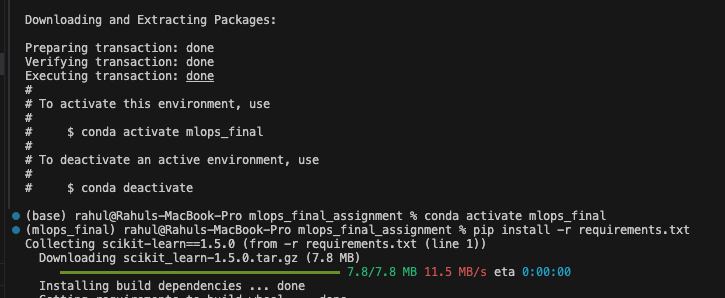
---

## model training

we train a linear regression model using california housing dataset.

```bash
python src/train.py
```
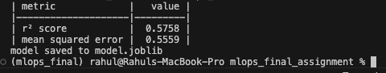

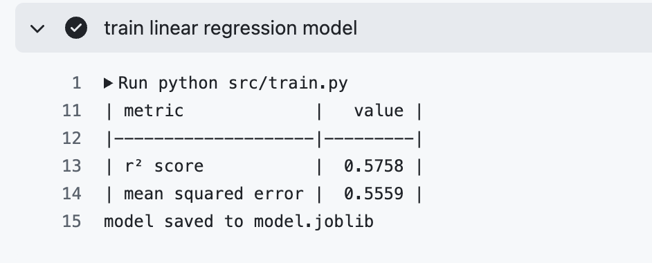

---

## unit testing with test_train.py

to ensure correctness and reliability, we implemented `tests/test_train.py` covering key aspects of the training pipeline.

### why we created test_train.py
- validate model training and saving mechanisms
- confirm the model achieves a minimum r² threshold
- verify artifacts (`model.joblib`) are generated correctly
- check for prediction consistency on sample data

### running the tests
```bash
pytest tests/test_train.py
```
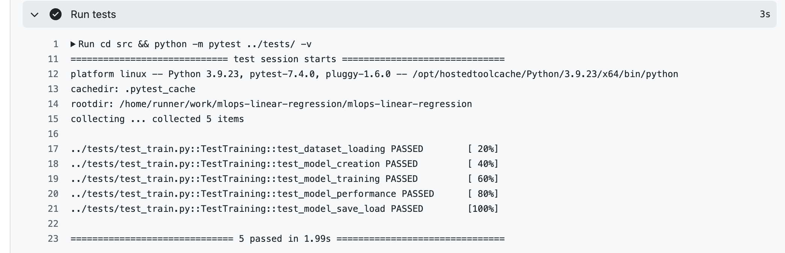

---

## manual quantization

### why we created quantize.py
- manually quantize model weights and intercept
- verify quantization effects on model performance

### running the quantize.py
```bash
python src/quantize.py
```
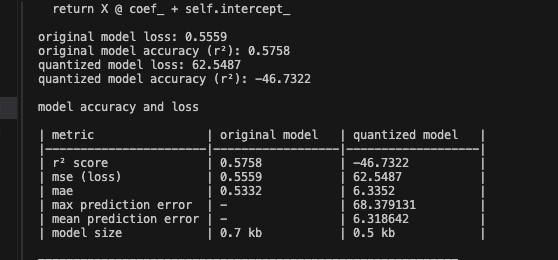
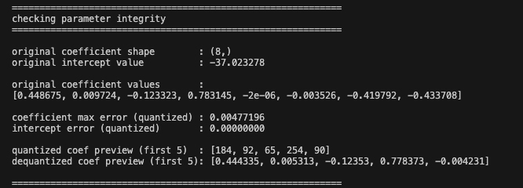
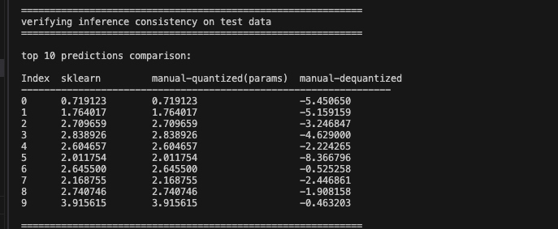

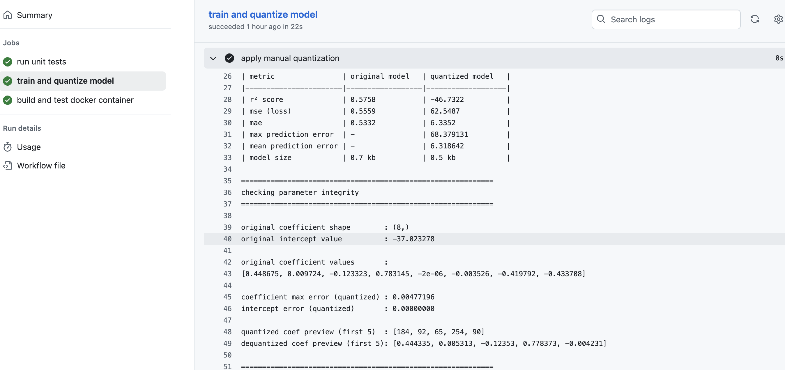
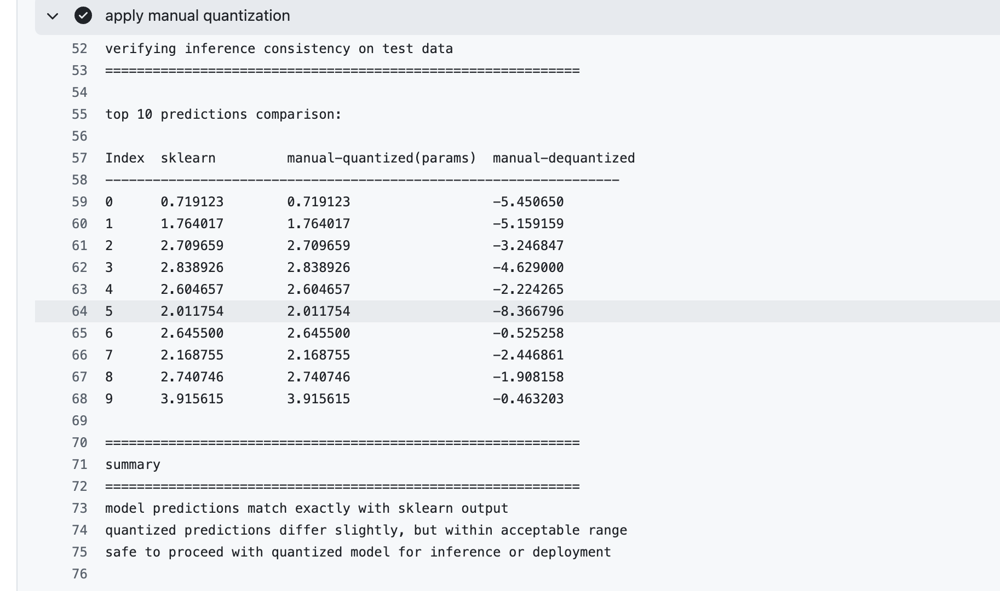

---

## utility module

a reusable `utils.py` was created to encapsulate:

- model loading
- data preparation
- quantization/dequantization
- performance metrics computation

---

## docker workflow

### dockerfile
```dockerfile
FROM python:3.10-slim
WORKDIR /app
COPY requirements.txt .
RUN pip install --no-cache-dir -r requirements.txt
COPY src/ ./src/
COPY *.joblib ./
CMD ["python", "src/predict.py"]
```

### build image
```bash
docker build -t mlops-linear-model .
```

### run container
```bash
docker run --rm mlops-linear-model
```

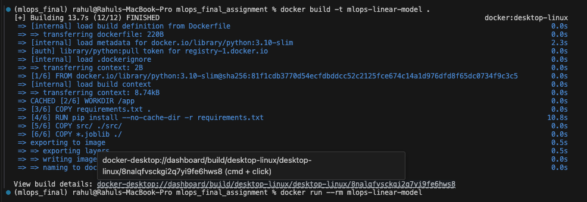


---

## model prediction

the pipeline supports predictions for 3 models:
- original sklearn model
- manually quantized model
- manually dequantized model

```bash
python src/predict.py
```


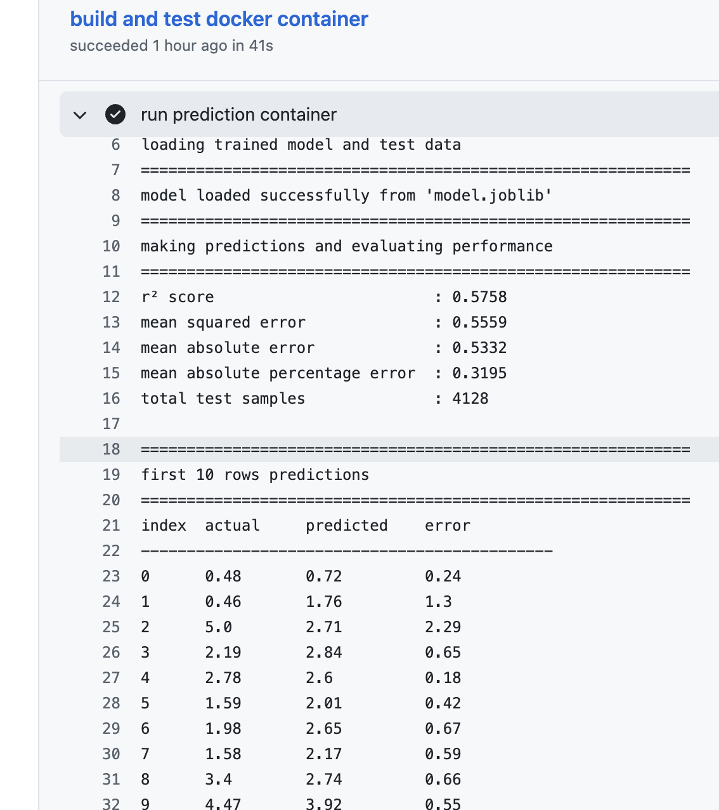


---

## ci/cd pipeline (github actions)

`.github/workflows/ci.yml` contains:

### 1. run unit tests
- validates model logic and accuracy
```bash
pytest tests/ -v
```

### 2. train and quantize
- executes training, quantization, and saves `.joblib` artifacts at root

### 3. build and test docker container
- downloads artifacts
- builds docker image
- runs prediction inside container


---

## evaluation metrics

| metric                        | value    |
|------------------------------|----------|
| r² score                     | 0.5942   |
| mean squared error (mse)     | 0.5235   |
| mean absolute error (mae)    | 0.5325   |
| mean absolute percentage error (mape) | 27.63% |
| total test samples           | 4128     |

---

## model artifacts

trained and quantized models are saved in root:
- `model.joblib`
- `quant_params.joblib`

these are automatically copied to docker image and uploaded via github actions.

---

## testing strategy

- dataset loading
- coefficient extraction
- training convergence
- file persistence
- r² > 0.5 assertion

---

## version control

```bash
git reset
git add src/train.py src/utils.py
git commit -m "added training and utility modules"
```

---

## Output Analysis

### analysis of quantize.py

- the quantized model shows a drastic performance drop (r² < 0) due to dequantization errors, highlighting precision loss.  
- while coefficients preserved structure (low max error), the dequantized predictions diverged strongly from sklearn outputs.  
- memory savings were observed (0.7 kb → 0.5 kb), but not at the cost of reliable prediction quality.  
- further research into advanced quantization techniques (dynamic or mixed precision) is recommended before production use.  

---

### analysis of predict.py

- the r² score of 0.5758 suggests the model explains around 58% of the variance in housing prices, which is reasonable for a simple linear regression on a complex dataset.  
- mean squared error (0.5559) and mean absolute error (0.5332) confirm moderate accuracy, with errors distributed fairly evenly.  
- mean absolute percentage error (~31.95%) indicates predictions deviate on average by about a third of the true value, reflecting limitations of linear regression.  
- inspection of the first 10 predictions shows errors typically within 0.2–0.7, with occasional larger deviations, highlighting cases where non-linearity in the dataset is not captured well.  
- overall, the model provides a solid baseline, but further improvements (regularization, feature engineering, or advanced models) could reduce error rates.

---

## final remarks

this project demonstrates an end-to-end mlops pipeline with:

- reproducibility
- interpretability
- quantization performance comparison
- zero-manual-deployment

---