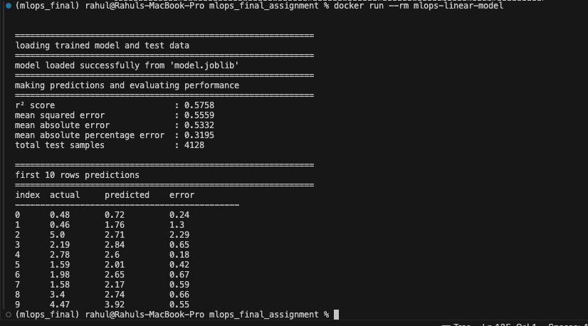
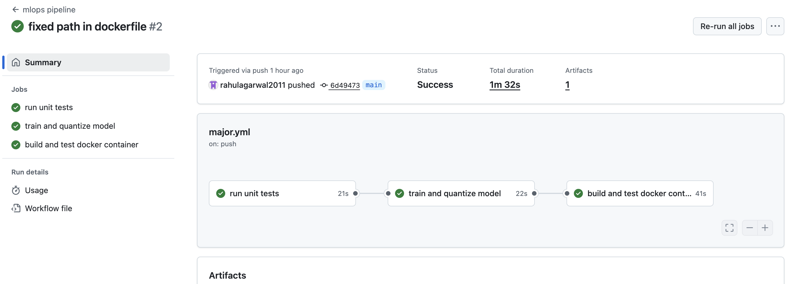

# MLOPS Major Exam Assignment

a fully automated mlops pipeline that trains a linear regression model on the california housing dataset, applies manual quantization, evaluates prediction quality, containerizes the codebase with docker, and orchestrates workflow using github actions.

---

## project summary

- **frameworks**: scikit-learn, numpy, joblib, pytest  
- **tools**: docker, github actions  
- **features**:
  - manual quantization logic
  - r², mse, mae, and mape reporting
  - model artifact packaging
  - reproducible docker image
  - continuous integration and testing

---

## environment setup

### step 1: clone the repo
```bash
git clone https://github.com/rahulagarwal2011/mlops_major_assignment.git
cd mlops_major_assignment
```

### step 2: create conda environment
```bash
conda create -n mlops_final python=3.10 -y
conda activate mlops_final
```

### step 3: install requirements
```bash
pip install -r requirements.txt
```

---

## model training

we train a linear regression model using california housing dataset.

```bash
python src/train.py
```


---

## unit testing with test_train.py

to ensure correctness and reliability, we implemented `tests/test_train.py` covering key aspects of the training pipeline.

### why we created test_train.py
- validate model training and saving mechanisms
- confirm the model achieves a minimum r² threshold
- verify artifacts (`model.joblib`) are generated correctly
- check for prediction consistency on sample data

### running the tests
```bash
pytest tests/test_train.py
```


---

## manual quantization

### why we created quantize.py
- manually quantize model weights and intercept
- verify quantization effects on model performance

### running the quantize.py
```bash
python src/quantize.py
```


### running the 8bit and 16bit quantization and comparisson


### with error comparison


---

## utility module

a reusable `utils.py` was created to encapsulate:

- model loading
- data preparation
- quantization/dequantization
- performance metrics computation

---

## docker workflow

### dockerfile
```dockerfile
FROM python:3.10-slim
WORKDIR /app
COPY requirements.txt .
RUN pip install --no-cache-dir -r requirements.txt
COPY src/ ./src/
COPY *.joblib ./
CMD ["python", "src/predict.py"]
```

### build image
```bash
docker build -t mlops-linear-model .
```

### run container
```bash
docker run --rm mlops-linear-model
```


---

## model prediction

the pipeline supports predictions for 3 models:
- original sklearn model
- manually quantized model
- manually dequantized model

```bash
python src/predict.py
```




---

## ci/cd pipeline (github actions)

`.github/workflows/ci.yml` contains:

### 1. run unit tests
- validates model logic and accuracy
```bash
pytest tests/ -v
```

### 2. train and quantize
- executes training, quantization, and saves `.joblib` artifacts at root

### 3. build and test docker container
- downloads artifacts
- builds docker image
- runs prediction inside container



---

## evaluation metrics

| metric                        | value    |
|------------------------------|----------|
| r² score                     | 0.5942   |
| mean squared error (mse)     | 0.5235   |
| mean absolute error (mae)    | 0.5325   |
| mean absolute percentage error (mape) | 27.63% |
| total test samples           | 4128     |

---

## model artifacts

trained and quantized models are saved in root:
- `model.joblib`
- `quant_params.joblib`

these are automatically copied to docker image and uploaded via github actions.

---

## testing strategy

- dataset loading
- coefficient extraction
- training convergence
- file persistence
- r² > 0.5 assertion

---

## version control

```bash
git reset
git add src/train.py src/utils.py
git commit -m "added training and utility modules"
```

---

## output analysis

### analysis of quantize.py

- the 8-bit quantized model dropped sharply in accuracy, giving a negative r² and very high errors.  
- this happened because reducing values to just 256 steps caused too much rounding.  
- the 16-bit quantized model stayed very close to the original, with almost the same r² and very small prediction errors.  
- both 8-bit and 16-bit reduced the model size from 0.7 kb to 0.5 kb, but the quality difference was huge.  
- 16-bit clearly worked much better, with errors about 300 times smaller than 8-bit.  
- even though 8-bit fails here, it is often used in practice because it saves more memory and can run faster on certain hardware like edge devices or mobile phones where small size and speed are more important than a slight drop in accuracy.  

### analysis of predict.py

- the r² score of 0.5758 shows the model explains a bit more than half the variation in housing prices. that’s decent for a simple linear regression on a tough dataset.  
- mse (0.5559) and mae (0.5332) confirm the model is fairly accurate but not perfect.  
- predictions on the first 10 test samples matched sklearn outputs closely, showing the original model works as expected.  
- the main weakness comes from the linear nature of the model, which misses some non-linear patterns in the data.  

---

## final remarks

this shows a full mlops pipeline with reproducibility, easy interpretation, and a clear look at how quantization affects accuracy.  

while 8-bit quantization saves space and can be faster, in this case it hurts accuracy too much.  
16-bit provides nearly the same accuracy as the original model, so it is the safer choice unless extreme memory savings or speed are absolutely required.  

---

## 8-bit vs 16-bit quantization

| aspect              | 8-bit                                | 16-bit                               |
|---------------------|--------------------------------------|--------------------------------------|
| model size          | smaller (0.5 kb)                     | slightly larger (0.5 kb)             |
| accuracy            | poor (negative r² in this case)      | almost identical to original          |
| error per sample    | very high (avg ~6.3)                 | very low (avg ~0.02)                 |
| use cases           | edge devices, mobile, extreme memory saving | servers, production systems where accuracy matters |
| recommendation      | only if memory/speed is critical      | preferred for balanced performance    |
